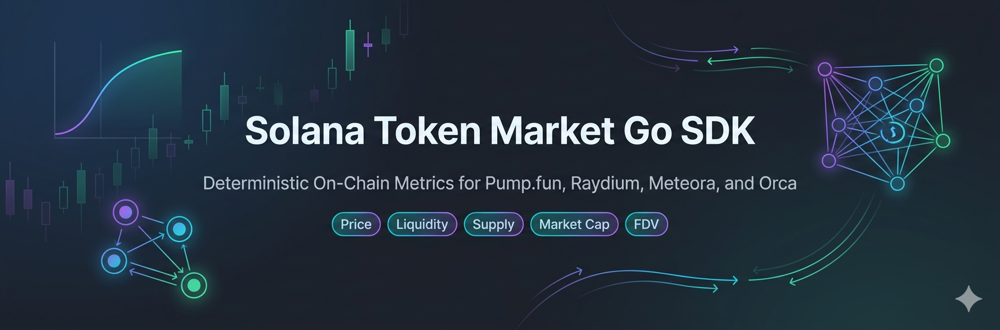

# Solana Token Market Go SDK

[](https://github.com/TokensHive/solana-token-market-go/actions/workflows/main-release.yml)
[](https://github.com/TokensHive/solana-token-market-go/actions/workflows/main-release.yml)
[](https://github.com/TokensHive/solana-token-market-go)
[](https://github.com/TokensHive/solana-token-market-go/blob/main/go.mod)
[](https://github.com/TokensHive/solana-token-market-go/blob/main/LICENSE)
[](https://github.com/TokensHive/solana-token-market-go/stargazers)



On-chain-first Go SDK for deterministic Solana token market metrics.  
This SDK focuses on a single responsibility: compute price, liquidity, supply, market cap, and FDV for an explicit `(DEX, pool version, mintA, mintB, pool address)` route.

## Demo Video

<details>
  <summary><strong>Watch Demo Video</strong></summary>

  [Open video](https://github.com/TokensHive/solana-token-market-go/blob/main/docs/media/examples-cli.mp4?raw=1)

</details>

## Why This SDK

- No opaque discovery dependency for core metrics paths
- Deterministic calculator routing by `Dex + PoolVersion`
- Protocol-native account decoding for each supported market
- Production-oriented: strict tests, strict coverage gate, extensible architecture

## Install

```bash
go get github.com/TokensHive/solana-token-market-go
```

## Public API Surface

- `market.NewClient(...)`
- `client.GetMetricsByPool(ctx, request)`
- `client.GetMetricsByPumpfunBondingCurve(ctx, request)` for Pump.fun `bonding_curve`
- `client.LastRequestDebug()`
- `market.WithPoolCalculatorFactory(route, factory)` for custom DEX integrations

## GetMetricsByPool Contract

### Request

`market.GetMetricsByPoolRequest` accepts:

| Field | Type | Description |
| --- | --- | --- |
| `Pool.Dex` | `market.Dex` | Top-level DEX family (`pumpfun`, `raydium`, `meteora`, `orca`, or your custom value). |
| `Pool.PoolVersion` | `market.PoolVersion` | Protocol/pool implementation identifier inside the DEX. |
| `Pool.PoolAddress` | `solana.PublicKey` | Pool account address for the exact route. |

`GetMetricsByPool` resolves output mints from pool state in canonical on-chain order (`A=pool token0/base`, `B=pool token1/quote`).
For Pump.fun `bonding_curve`, use `GetMetricsByPumpfunBondingCurve` (mint-based request) because the curve account layout does not include token mint fields.

### Response

`market.GetMetricsByPoolResponse` includes:

| Property | Meaning |
| --- | --- |
| `MintA` | Canonical base mint resolved from pool state (or from bonding-curve method request). |
| `MintB` | Canonical quote mint resolved from pool state (or from bonding-curve method request). |
| `PriceOfAInB` | Spot price of `MintA` denominated in `MintB`. |
| `PriceOfAInSOL` | Spot price of `MintA` normalized to SOL. |
| `LiquidityInB` | Total two-sided pool liquidity expressed in `MintB` units. |
| `LiquidityInSOL` | Total two-sided pool liquidity normalized to SOL. |
| `TotalSupply` | Token total supply used for analytics. |
| `CirculatingSupply` | Circulating supply from configured supply provider. |
| `MarketCapInSOL` | `PriceOfAInSOL * CirculatingSupply`. |
| `FDVInSOL` | `PriceOfAInSOL * fdv_supply`. |
| `SupplyMethod` | Supply derivation strategy label. |
| `Metadata` | Protocol-specific diagnostics: reserves, raw fields, decimals, fee data, FDV method/supply, source labels. |

## Supported DEXes and Pool Versions

### Pump.fun

| Pool Version | Program ID (Mainnet) | IDL/Layout | Operations |
| --- | --- | --- | --- |
| `bonding_curve` | `6EF8rrecthR5Dkzon8Nwu78hRvfCKubJ14M5uBEwF6P` | [`pump.json`](https://github.com/pump-fun/pump-public-docs/blob/main/idl/pump.json) | `GetMetricsByPumpfunBondingCurve` |
| `pumpswap_amm` | `pAMMBay6oceH9fJKBRHGP5D4bD4sWpmSwMn52FMfXEA` | [`pump_amm.json`](https://github.com/pump-fun/pump-public-docs/blob/main/idl/pump_amm.json) | `GetMetricsByPool` |

### Raydium

| Pool Version | Program ID (Mainnet) | IDL/Layout | Operations |
| --- | --- | --- | --- |
| `liquidity_v4` | `675kPX9MHTjS2zt1qfr1NYHuzeLXfQM9H24wFSUt1Mp8` | [`raydium_amm/idl.json`](https://github.com/raydium-io/raydium-idl/blob/master/raydium_amm/idl.json) | `GetMetricsByPool` |
| `cpmm` | `CPMMoo8L3F4NbTegBCKVNunggL7H1ZpdTHKxQB5qKP1C` | [`raydium_cp_swap.json`](https://github.com/raydium-io/raydium-idl/blob/master/raydium_cpmm/raydium_cp_swap.json) | `GetMetricsByPool` |
| `clmm` | `CAMMCzo5YL8w4VFF8KVHrK22GGUsp5VTaW7grrKgrWqK` | [`amm_v3.json`](https://github.com/raydium-io/raydium-idl/blob/master/raydium_clmm/amm_v3.json) | `GetMetricsByPool` |
| `launchpad` | `LanMV9sAd7wArD4vJFi2qDdfnVhFxYSUg6eADduJ3uj` | [`layout.ts`](https://github.com/raydium-io/raydium-sdk-V2/blob/master/src/raydium/launchpad/layout.ts), [`states.rs`](https://github.com/raydium-io/raydium-cpi/blob/master/programs/launch-cpi/src/states.rs) | `GetMetricsByPool` |

### Meteora

| Pool Version | Program ID (Mainnet) | IDL/Layout | Operations |
| --- | --- | --- | --- |
| `dlmm` | `LBUZKhRxPF3XUpBCjp4YzTKgLccjZhTSDM9YuVaPwxo` | [`dlmm.json`](https://github.com/MeteoraAg/dlmm-sdk/blob/main/idls/dlmm.json) | `GetMetricsByPool` |
| `dbc` | `dbcij3LWUppWqq96dh6gJWwBifmcGfLSB5D4DuSMaqN` | [`dynamic-bonding-curve idl.json`](https://github.com/MeteoraAg/dynamic-bonding-curve-sdk/blob/main/packages/dynamic-bonding-curve/src/idl/dynamic-bonding-curve/idl.json) | `GetMetricsByPool` |
| `damm_v1` | `Eo7WjKq67rjJQSZxS6z3YkapzY3eMj6Xy8X5EQVn5UaB` | [`damm-v1 idl.ts`](https://github.com/MeteoraAg/damm-v1-sdk/blob/main/ts-client/src/amm/idl.ts) | `GetMetricsByPool` |
| `damm_v2` | `cpamdpZCGKUy5JxQXB4dcpGPiikHawvSWAd6mEn1sGG` | [`cp_amm.json`](https://github.com/MeteoraAg/damm-v2-sdk/blob/main/src/idl/cp_amm.json) | `GetMetricsByPool` |

### Orca

| Pool Version | Program ID (Mainnet) | IDL/Layout | Operations |
| --- | --- | --- | --- |
| `whirlpool` | `whirLbMiicVdio4qvUfM5KAg6Ct8VwpYzGff3uctyCc` | [Whirlpool IDL docs](https://dev.orca.so/More%20Resources/IDL/) | `GetMetricsByPool` |

## Quick Start

```go
client, err := market.NewClient(
	market.WithRPCClient(rpc.NewSolanaRPCClient("https://api.mainnet-beta.solana.com")),
	market.WithDebugRequests(true),
)
if err != nil {
	panic(err)
}

resp, err := client.GetMetricsByPool(ctx, market.GetMetricsByPoolRequest{
	Pool: market.PoolIdentifier{
		Dex:         market.DexPumpfun,
		PoolVersion: market.PoolVersionPumpfunAmm,
		PoolAddress: solana.MustPublicKeyFromBase58("EQqvZi6mSaQL95wWkP5vGBX6ZsAkVTqZCV88rQU1fbcY"),
	},
})
if err != nil {
	panic(err)
}

fmt.Println(resp.MintA, resp.MintB, resp.PriceOfAInSOL, resp.LiquidityInSOL, resp.MarketCapInSOL, resp.FDVInSOL)
```

Pump.fun bonding curve quick start:

```go
resp, err := client.GetMetricsByPumpfunBondingCurve(ctx, market.GetMetricsByPumpfunBondingCurveRequest{
	MintA: solana.MustPublicKeyFromBase58("9BHt7aq3DFCb74kZjPY5epgVtsWKCeYX1tUWxYwDpump"),
	MintB: solana.SolMint,
})
if err != nil {
	panic(err)
}

fmt.Println(resp.Pool.PoolAddress, resp.PriceOfAInSOL, resp.MarketCapInSOL)
```

## Example CLI

Interactive mode:

```bash
go run ./examples
```

Batch mode:

```bash
go run ./examples -interactive=false
```

Useful flags:

- `-rpc`: custom RPC endpoint
- `-timeout`: request timeout (for example `60s`)
- `-debug`: include/exclude `LastRequestDebug()` output

## Milestone: Resilience, Performance, and Integrations

### Performance KPI

- Target: reduce average `GetMetricsByPool` latency by **20-30%** on common pools.

### RPC Resilience Matrix

| Call Type | Timeout Target | Retry Strategy | Fallback Pattern | Notes |
| --- | --- | --- | --- | --- |
| `GetAccount` | 700ms to 1200ms | 2 retries, exponential backoff with jitter (`100ms`, `250ms`) | switch RPC endpoint on timeout/5xx | used for primary pool account reads |
| `GetMultipleAccounts` | 900ms to 1500ms | 2 retries, chunk-aware retries | fallback endpoint + reduce chunk size | highest impact on latency; optimize batching |
| `GetTokenSupply` | 600ms to 1000ms | 1 retry | fallback endpoint | usually lightweight but required for supply pipeline |
| `GetSignaturesForAddress` | 1200ms to 2500ms | 1 retry | fallback endpoint | mostly for optional workflows, not core metrics path |
| `GetTransaction` / `GetTransactionRaw` | 1500ms to 3000ms | 1 retry | fallback endpoint + lower concurrency | heavy payload path; keep isolated from metrics fast path |

Recommended defaults:

- keep short request deadlines (`context.WithTimeout`)
- run independent RPC calls concurrently
- limit in-flight RPC fanout per request
- use failover RPC client for endpoint fallback
- emit request telemetry and monitor P50/P95/P99 latencies

### Integration Examples

#### 1) Backend API server

```go
type Server struct {
    client *market.Client
}

func (s *Server) HandleMetrics(w http.ResponseWriter, r *http.Request) {
    ctx, cancel := context.WithTimeout(r.Context(), 2*time.Second)
    defer cancel()

    req := decodeRequest(r) // parse dex/poolVersion/poolAddress
    resp, err := s.client.GetMetricsByPool(ctx, req)
    if err != nil {
        http.Error(w, err.Error(), http.StatusBadRequest)
        return
    }
    json.NewEncoder(w).Encode(resp)
}
```

#### 2) Cron / indexer

```go
func runIndexer(ctx context.Context, client *market.Client, pools []market.PoolIdentifier) error {
    ticker := time.NewTicker(30 * time.Second)
    defer ticker.Stop()
    for {
        select {
        case <-ctx.Done():
            return ctx.Err()
        case <-ticker.C:
            for _, pool := range pools {
                req := market.GetMetricsByPoolRequest{Pool: pool}
                resp, err := client.GetMetricsByPool(ctx, req)
                if err == nil {
                    persistSnapshot(pool, resp) // write DB/time-series
                }
            }
        }
    }
}
```

#### 3) Trading bot pre-trade checks

```go
func preTradeCheck(ctx context.Context, client *market.Client, req market.GetMetricsByPoolRequest) error {
    resp, err := client.GetMetricsByPool(ctx, req)
    if err != nil {
        return err
    }
    if resp.LiquidityInSOL.LessThan(decimal.RequireFromString("50")) {
        return fmt.Errorf("insufficient liquidity")
    }
    if resp.PriceOfAInSOL.IsZero() {
        return fmt.Errorf("invalid price")
    }
    return nil
}
```

#### 4) Realtime pipeline with Geyser gRPC

Use Geyser gRPC for account-change streaming, then recompute metrics only for affected pools:

```go
func onAccountUpdate(update *geyserpb.AccountUpdate) {
    // 1) map changed account -> impacted pools
    // 2) enqueue recompute jobs
}

func worker(ctx context.Context, client *market.Client, jobs <-chan market.PoolIdentifier) {
    for pool := range jobs {
        req := market.GetMetricsByPoolRequest{Pool: pool}
        resp, err := client.GetMetricsByPool(ctx, req)
        if err == nil {
            publishRealtimeStats(pool, resp) // websocket/kafka/redis stream
        }
    }
}
```

Suggested realtime architecture:

- ingest: Geyser gRPC account stream
- routing: account-to-pool impact map
- compute: bounded worker pool calling `GetMetricsByPool`
- output: websocket broadcast + durable store for charts/stats

## Extending With New Markets

Use the route registry extension point:

```go
client, err := market.NewClient(
	market.WithRPCClient(rpc.NewSolanaRPCClient("https://api.mainnet-beta.solana.com")),
	market.WithPoolCalculatorFactory(
		market.PoolRoute{Dex: "my_dex", PoolVersion: "my_pool_v1"},
		func(cfg market.Config) market.PoolCalculator {
			return myCalculator{cfg: cfg}
		},
	),
)
```

See detailed extension guides:

- [`CONTRIBUTING.md`](./CONTRIBUTING.md)
- [`MAINTAINERS.md`](./MAINTAINERS.md)
- [`docs/ADDING_NEW_DEX.md`](./docs/ADDING_NEW_DEX.md)
- [`docs/liquidity-versions`](./docs/liquidity-versions)
